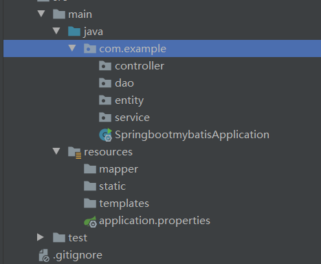
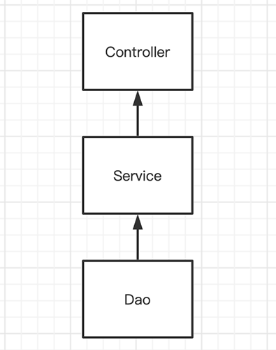
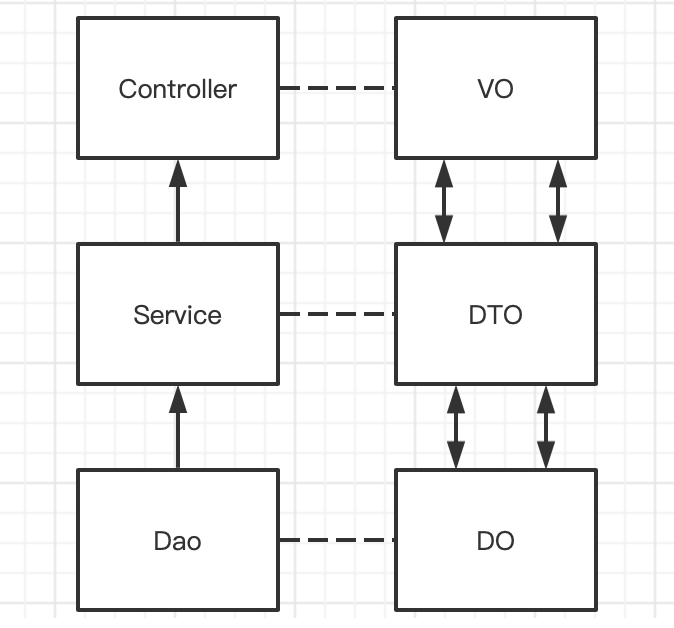

## 1. 基础概念

1. **POJO（Plain Ordinary Java Object）**：即简单 Java 对象，就是一个我们最常见的普通 Java 对象，这个概念是被大家叫出来的，它具有一些属性，然后提供对应的 getter 和 setter。**即不与数据库打交道的简单 JavaBean 对象。**
2. **Entity** ：Entity 里的每一个字段，与数据库相对应。一个类对应一张数据库表。
3. **Domain**：一般包括Entity、Enums。一个 Domain 可能包含多张相互关联的数据表，主从表合体。
4. **VO（View Object）**：Controller 层的数据实体。视图对象，用于展示层，它的作用是把某个指定页面（或组件）的所有数据封装起来。即和 html、jsp 等页面属性对应的 Java 对象。
5. **DTO（Data Transfer Object）**：Service 层的数据实体。数据传输对象，泛指用于展示层与服务层之间的数据传输对象。即提取数据库中所需要的的属性减少不需要的属性来提高传输速度、流量。
   比如前端发来请求某一字段（User 的名字），实际数据库返回一个拥有全部字段的返回值，造成冗余。这时候可以用 DTO，在 controller 再把 DTO 转成 Entity。
6. **DO (Data Object)** ：DAO 层的数据实体。
7. **DAO（Data Access Object）**：数据访问对象，它是一个面向对象的数据库接口，负责持久层的操作，为业务层提供接口，主要用来封装对数据库的访问，常见操作无外乎 CURD。我们也可以认为一个 DAO 对应一个 POJO 的对象，它位于业务逻辑与数据库资源中间，可以结合 PO 对数据库进行相关的操作。
8. **Mapper**：Mapper 本质是一个 DAO。Mapper 为 ServiceImpl 提供操作数据的方法，但方法的具体实现（也就是 SQL 语句）放在了 Mapper 下的 xml 文件里。
9. **Service**：提供业务逻辑要用到的方法的接口，底下创建 ServiceImpl 实现具体功能。只要没访问数据库的，都要在业务里写。
   ServiceImpl 负责了主要的功能编写，Controller提供了使用的入口。
10. **Controller**：通过接收前端传过来的参数进行业务操作，再将处理结果返回到前端，为前端提供的访问入口，不用关心具体的业务逻辑。


## 2. 程序结构

我们在 com.example 目录下新建四个目录，分别是 Controller、DAO (Mapper)、Entity (Domain)、Service。



- Controller 层负责前端传过来的具体的业务模块流程的控制，交给 Service 层处理。
- Service 层主要负责业务模块的逻辑应用设计，具体要调用到已定义的 DAO 层的接口
- Dao 层主要是做数据持久层的工作，负责与数据库联络，直接针对数据库操作，封装了增删改查基本操作
- Entity 层用于存放我们的实体类，与数据库中的属性值基本保持一致，实现 set 和 get 的方法

然后在 resources 目录下新建 mapper 目录。这个 mapper 目录是用来存放 SQL 语句的地方。static 目录下存放静态资源，如 CSS, JavaScript,图片 等页面资源。templates 目录下存放动态资源，如 JSP, thymeleaf 等模板页面。

> 默认情况下，静态资源 (static)可以直接访问，动态资源 (templates)无法直接访问。Maven 里引入了 thymeleaf 模板依赖后可以访问动态资源，且把静态资源页面覆盖掉。


## 3. 传统 MVC 框架

即 model-view-controller 三层架构。

- model 层 = Entity 层，与数据库的数据表对应

- mapper 层 = DAO 层，对数据库进行数据持久化操作

- view 层 = Controller 层，是做前端界面的展示，做业务模流程块的控制


情景：
不管是什么框架，我们很多时候都会与数据库进行交互。如果遇到一个场景我们都要去写 SQL 语句，那么我们的代码就会很冗余。所以，我们就想到了把数据库封装一下，让我们的数据库的交道看起来像和一个对象打交道，这个对象通常就是 DAO。当我们操作这个对象的时候，这个对象会自动产生 SQL 语句来和数据库进行交互，我们就只需要使用 DAO 就行了。**SQL 语句通常写在 mapper 文件里面的**。

Service 层是建立在 DAO 层之上的，建立了 DAO 层后才可以建立 Service 层，而Controller 层又是在 Service 层之上的，因而 Service 层应该既调用 DAO 层的接口，又要提供接口给 Controller 层的类来进行调用，它刚好处于一个中间层的位置。每个模型都有一个 Service 接口，每个接口分别封装各自的业务处理方法。

层级建立顺序：

**Entity -> DAO -> Service -> Controller**

用户从页面前端，也就是我们所说的 View 层进行查询访问，进入到 Controller 层找到对应的接口，接着 Controller 进行对 Service 层进行业务功能的调用，Service 要进入 DAO 层查询数据，DAO 层调用 mapper.xml 文件生成 SQL 语句到数据库中进行查询。

在数据库中查询到数据，DAO 层拿到实体对象的数据，接着交付给 Service 层，接着 Service 进行业务 逻辑的处理，返回结果给 Controller，Controller 根据结果进行最后一步的处理，返回结果给前端页面。

一个用户访问页面的实际逻辑流程为：

**View -> Controller -> Service -> DAO -> (mapper操作Entity) -> DAO -> Service -> Controller -> View**

这里 mapper 指的是存放 SQL 语句的 xml 文件，mapper 里面的 SQL 操作 Entity 类来对数据库进行增删改查。

如果业务类型复杂，Entity 会改为用 Domain。例如个人简历，里面的基本个人信息可以放一张表，但是由于工作经历或者个人技能众多，也放在个人基本信息表里就不好增删改查，一般会单独放一张从表。由多张主从表构成的大型 Entity 叫做 Domain。

Domain -> Mapper (DAO) -> Service -> Controller


## 4. 数据实体转换

在我们正常的三层架构下会有 `Controller`、`Service`、`Dao` 层，他们的依赖是自顶向下的。如下：



我们进行代码分包的时候，我们一般都会规定上层是不能依赖下层；而层与层之间是需要进行数据交互的，所以产生了三个类型的基本数据实体：`VO`、`DTO`、`DO`，他们分包对应的 `Controller`层、`Service` 层、`Dao` 层，转换顺序如下：



你会发现，这个过程需要转换的次数是4次。 例如一次查询 (Request) 并返回结果 (Response)，那么的它的转换顺序如下：

**RequestVO  -->  RequestDTO -->  RequestDO 和 ResponseDO  -->  ResponseDTO  -->  ResponseVO**


这个在实际的开发工程中，我会感觉特别烦，一次简单的查询竟然要操作6个实体类，4个转换方法。 所以，我对其做了一个减法：

1. 去掉 `ResponseVO`，`ResponseDTO` 和 `ResponseDO` 都可以直接返回给前端，**但是不能暴露表结构**。
2. 合并 `RequestDO` 和 `ResponseDO`，即它们就是 `DO`。
3. 在某些场景下合并 `RequestDTO` 和 `ResponseDTO`。

这样子，我只剩下了：`VO`、`DTO`、`DO`，转换的次数一般都会是2次。


我们项目编程规约,结合swaggger看：

1. Controller 层接收 DTO 请求参数 ，并进行简单参数校验。

2. Controller 层调用了 Service 层的接口方法。

3. Service 层调用 Dao 层的方法，返回 DO 的 Entity 对象。

4. Service 层封装了前端需要 VO 对象，返回给 Controller 层

5. Controller 层返回 VO 给前端。
   


## 5. 方法命名和方法签名


```java
// --------- 新增 ---------
// Controlelr层
public ApiResponse create(@Valid  @RequestBody SysUserSaveForm form)
// Service层
public void create(SysUserSaveDTO info);

// --------- 编辑 ---------
public ApiResponse modify(@PathVariable("id") Long id, @Valid  @RequestBody SysUserSaveForm form)
public void modify(Long id, SysUserSaveDTO info);

// --------- 查询 ---------
public ApiResponse<SysUserInfoDTO> info(@PathVariable("id") Long id)
public SysUserInfoDTO info(Long id);

// --------- 删除 ---------
public ApiResponse delete(@PathVariable("id") Long id)
public void delete(Long id);

// --------- 分页 ---------
public ApiResponse<Page<SysUserExt>> page(@RequestBody SysUserPageForm form)
public Page<SysUserExt> page(SysUserPageDTO query);

```

对于业务对象或者实体类型的`Controller`和`Service`都会有以上5个基本方法，而关联对象或者非业务对象或者实体则不会有这5个基本方法。举个例子：用户、角色都是属于业务对象，都会有这5个基本方法，而用户和角色的关联关系表则不会有这5个基本方法，设置它都不会有对应的`Controller`和`Service类`。

`create`和`modify`方法他们的数据实体一般都是一样的，只是一个有id，一个没有id，所以不管在`Controller`或者`Service`层都会**显示**的的去传递这个id，这样子就能保证`SysUserSaveForm` 和 `SysUserSaveDTO` 数据实体的字段是一一对应的。

在`Controller`层只会做2件事：

1. 数据校验，这个都会通过在数据实体`Form`上的注解配合`@Valid`注解进行处理。
2. 数据转换，这里推荐使用`mapsturct`组件进行数据转换，会省事很多。


### 聚合的`Service`层

在我理解的`Service`层它应该是处理少量的简单业务逻辑；如果涉及某个复杂业务，则为该复杂业务单独新增一个`ServiceA`类，由当前的`Service`持有`ServiceA`的引用，并且提供对应的`get`方法。其他的业务`Service`如果要引用`ServiceA`则不能直接通过`@Autowired`进行注入，而必须通过其主业务的`Service`的`getXXXService`来获取。

总而言之，在当前业务下，只有一个`Service`类会对外提供服务，其子业务通过`getXXXService`来获取。是不是有`DDD`那套关于聚合根的那味了？

`Service`层还会持有一个到多个的`Repository`的引用。`Service`层关于复杂的业务逻辑会剥离到其他的`子Service`服务中，而关于数据库相关的操作则剥离到`Repository`当中。举个例子：

`SysUserService`会持有`SysUserRepository`的引用，并提供`getRepository`方法来获取`SysUserRepository`的实例。`SysUserService`类中除了上一节的5个基本方法，涉及其他的简单或者复杂的数据库操作都应放在`SysUserRepository`当中，例如`getByUsername`这种应该放在`SysUserRepository`中。 另外，`SysUserService`可能会持有其关联表的`Repository`，例如用户和角色的关联表`SysUserRoleRepository`。

`Service`是其子业务`Service`和关联的`Repository`聚合，它会提供的对应的`getXXX`方法，其他业务的`Service`不能直接引用别的业务的子业务`Service`和关联的`Repository`。

通过以上表述的一些规范，这样子我们的`Service`就不再臃肿，而只是一个负责调度或者编排的工具人了。

